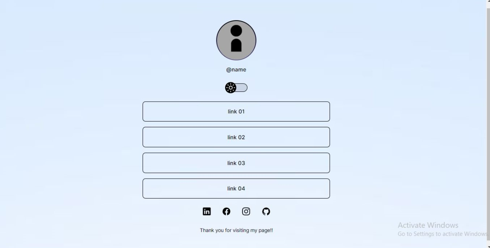
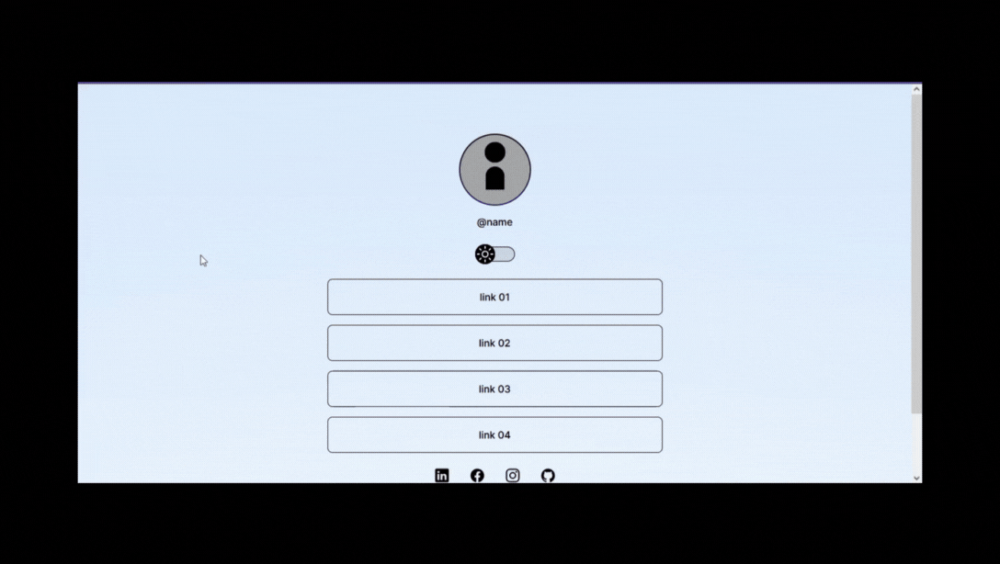

<h1 align = center>Link tree</h1>

This is a project for a link tree.

	<a href="#technologies">Technologies</a>&nbsp;&nbsp;&nbsp;|&nbsp;&nbsp;&nbsp;
  <a href="#project">Project</a>&nbsp;&nbsp;&nbsp;|&nbsp;&nbsp;&nbsp;
  <a href="#demonstration">Demonstration</a>&nbsp;&nbsp;&nbsp;|&nbsp;&nbsp;&nbsp;
	<a href="#license">License</a>

  

 

## Technologies

This project used these technologies:

- HTML;
- CSS;
- JavaScript;
- Git & GitHub.

 

## Project

A "hub" where the owner can centralize their site, social media and other links.  Very useful for small businesses. 

Features:

- Dark/light mode;
- Simple animations.

 

## Demonstration
### Desktop

 

### Mobile

 

## License
This project is under the MIT license.

  

---

## Thanks for reading!  Diego